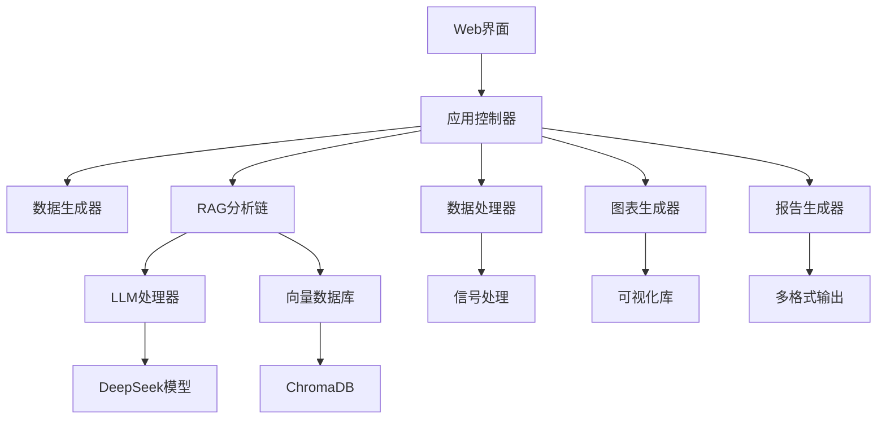

# CMS振动分析报告系统

[](https://github.com/your-repo/cms-vibration-rag)
[](https://python.org)
[](LICENSE)
[](https://streamlit.io)

基于RAG（检索增强生成）技术的风电机组状态监测系统（CMS）振动分析报告自动生成平台。

## 🆕 最新更新 (v1.1.0)

- ✅ **修复智能分析显示问题**: 完善分析结果展示，支持总体评估、各测点详细分析、故障诊断和建议措施
- ✅ **增强状态处理**: 新增"注意"状态支持，完善报警级别分类和UI显示
- ✅ **优化数据概览**: 改进测点统计显示，支持4级报警状态（正常/注意/警告/危险）
- ✅ **完善异常处理**: 增强系统稳定性，优化错误提示和日志记录
- 🔧 **依赖更新**: 更新requirements.txt，添加必要的依赖包

## 🚀 功能特性

### 核心功能
- **智能振动分析**: 基于DeepSeek-7B大语言模型的振动数据智能分析
- **知识库检索**: 集成专业振动分析知识库，提供精准的故障诊断参考
- **多格式报告**: 支持PDF、Word、HTML三种格式的专业分析报告生成
- **可视化图表**: 自动生成时域波形、频谱图、趋势图等专业图表
- **实时监测**: 支持多风场、多机组的实时振动数据监测

### 技术特点
- **RAG架构**: 结合向量数据库和大语言模型，提供准确的专业分析
- **模块化设计**: 清晰的代码架构，易于扩展和维护
- **用户友好**: 基于Streamlit的直观Web界面
- **高性能**: 优化的数据处理和模型推理流程

## 📁 项目结构

```
cms_vibration_rag/
├── app.py                    # 主应用程序
├── requirements.txt          # 依赖包列表
├── README.md                # 项目说明
├── config/                  # 配置文件
│   ├── __init__.py
│   ├── settings.py          # 系统配置
│   └── prompts.py           # 提示词模板
├── data/                    # 数据模块
│   ├── __init__.py
│   └── mock_data.py         # 模拟数据生成
├── rag/                     # RAG核心模块
│   ├── __init__.py
│   ├── llm_handler.py       # LLM处理器
│   ├── vector_store.py      # 向量数据库
│   └── chain.py             # RAG链条
├── utils/                   # 工具模块
│   ├── __init__.py
│   ├── data_processor.py    # 数据处理
│   └── chart_generator.py   # 图表生成
├── report/                  # 报告生成
│   ├── __init__.py
│   └── generator.py         # 报告生成器
└── logs/                    # 日志文件
```

## 🛠️ 安装部署

### 环境要求
- Python 3.8+
- CUDA 11.8+ (GPU推理，可选)
- 内存: 16GB+ (推荐)
- 存储: 20GB+ (模型文件)

### 安装步骤

1. **克隆项目**
```bash
git clone <repository-url>
cd cms_vibration_rag
```

2. **创建虚拟环境**
```bash
python -m venv venv
source venv/bin/activate  # Linux/Mac
# 或
venv\Scripts\activate     # Windows
```

3. **安装依赖**
```bash
pip install -r requirements.txt
```

4. **下载模型**
```bash
# 下载DeepSeek-7B模型到models目录
# 或配置模型路径在config/settings.py中
```

5. **启动应用**
```bash
streamlit run app.py
```

## 📖 使用指南

### 快速开始

1. **启动系统**
   - 运行 `streamlit run app.py`
   - 在浏览器中打开 `http://localhost:8501`

2. **初始化模型**
   - 点击侧边栏的"初始化LLM模型"按钮
   - 等待模型加载完成

3. **生成测试数据**
   - 选择风场和风机
   - 选择故障模式
   - 点击"生成测试数据"

4. **查看数据概览**
   - 在"数据概览"标签页查看基本信息
   - 查看各测点的振动数据和统计信息

5. **智能分析**
   - 切换到"智能分析"标签页
   - 点击"开始分析"进行AI分析
   - 查看分析结果和建议

6. **生成图表**
   - 在"图表展示"标签页选择图表类型
   - 点击"生成图表"查看可视化结果

7. **生成报告**
   - 在"报告生成"标签页配置报告参数
   - 选择报告格式（PDF/Word/HTML）
   - 点击"生成报告"并下载

### 高级功能

#### 自定义配置
编辑 `config/settings.py` 文件可以自定义：
- 模型路径和参数
- 风场和机组配置
- 报警阈值设置
- 图表样式配置

#### 扩展知识库
在 `rag/vector_store.py` 中添加专业知识：
```python
# 添加新的振动分析知识
knowledge_base.add_document(
    "新的故障诊断知识...",
    metadata={"category": "fault_diagnosis", "source": "专家经验"}
)
```

#### 自定义提示词
在 `config/prompts.py` 中修改分析提示词模板，优化AI分析效果。

## 🔧 配置说明

### 模型配置
```python
MODEL_CONFIG = {
    "model_name": "deepseek-ai/deepseek-llm-7b-chat",
    "model_path": "/path/to/model",
    "device": "auto",  # auto, cpu, cuda
    "max_length": 4096,
    "temperature": 0.7
}
```

### 风场配置
```python
WIND_FARM_CONFIG = {
    "华能风场A": {
        "location": "内蒙古",
        "capacity": "200MW",
        "turbines": ["A01", "A02", "A03"]
    }
}
```

### CMS配置
```python
CMS_CONFIG = {
    "measurement_points": [
        "主轴承DE", "主轴承NDE", "齿轮箱HSS", "发电机DE"
    ],
    "sampling_rate": 25600,
    "frequency_range": [0, 12800],
    "alarm_levels": {
        "正常": [0, 2.8],
        "注意": [2.8, 7.1],
        "报警": [7.1, 18.0]
    }
}
```

## 🎯 核心模块说明

### RAG模块
- **LLM Handler**: 管理DeepSeek模型的加载和推理
- **Vector Store**: 基于ChromaDB的向量知识库
- **Analysis Chain**: 整合检索和生成的分析链条

### 数据处理
- **时域分析**: RMS、峰值、峭度等统计特征
- **频域分析**: FFT、功率谱密度、主频率识别
- **包络分析**: 轴承故障特征提取
- **阶次分析**: 转速相关故障诊断

### 图表生成
- **时域波形**: 振动信号时间序列图
- **频谱图**: 频域分析结果
- **瀑布图**: 时频分析可视化
- **趋势图**: 长期监测趋势
- **设备总览**: 多测点综合展示

### 报告生成
- **PDF报告**: 专业格式，适合打印和存档
- **Word报告**: 可编辑格式，便于修改
- **HTML报告**: 网页格式，便于分享

## 🚨 故障排除

### 常见问题

1. **模型加载失败**
   - 检查模型路径是否正确
   - 确认有足够的内存和存储空间
   - 检查CUDA环境（GPU模式）

2. **依赖包安装失败**
   - 更新pip: `pip install --upgrade pip`
   - 使用国内镜像: `pip install -i https://pypi.tuna.tsinghua.edu.cn/simple/`

3. **图表显示异常**
   - 检查matplotlib后端设置
   - 确认字体文件存在

4. **报告生成失败**
   - 检查输出目录权限
   - 确认ReportLab和python-docx正确安装

### 性能优化

1. **GPU加速**
   - 安装CUDA版本的PyTorch
   - 设置 `device="cuda"` 在模型配置中

2. **内存优化**
   - 减少批处理大小
   - 启用模型量化
   - 定期清理缓存

3. **并发处理**
   - 使用多进程处理大批量数据
   - 异步处理长时间任务

## 📊 系统架构



## 🤝 贡献指南

欢迎贡献代码和建议！请遵循以下步骤：

1. Fork 项目
2. 创建特性分支 (`git checkout -b feature/AmazingFeature`)
3. 提交更改 (`git commit -m 'Add some AmazingFeature'`)
4. 推送到分支 (`git push origin feature/AmazingFeature`)
5. 开启 Pull Request

### 代码规范
- 使用 Black 进行代码格式化
- 遵循 PEP 8 编码规范
- 添加适当的注释和文档字符串
- 编写单元测试

## 📄 许可证

本项目采用 MIT 许可证 - 查看 [LICENSE](LICENSE) 文件了解详情。

## 📞 联系方式

- 项目维护者: [Your Name]
- 邮箱: [your.email@example.com]
- 项目地址: [GitHub Repository URL]

## 📋 版本历史

### v1.1.0 (2024-01-13)
- 修复智能分析结果显示问题
- 新增"注意"状态支持和UI优化
- 完善故障诊断和建议生成功能
- 优化数据概览页面统计显示
- 增强系统异常处理和稳定性
- 更新依赖包和开发工具

### v1.0.0 (2024-01-01)
- 初始版本发布
- 基础RAG分析功能
- 多格式报告生成
- Web界面和可视化
- 模拟数据生成

## 🚀 Git版本控制指南

### 初始化Git仓库
```bash
# 进入项目目录
cd cms_vibration_rag

# 初始化Git仓库
git init

# 添加所有文件
git add .

# 提交初始版本
git commit -m "feat: 初始版本发布 v1.1.0

- 完整的CMS振动分析系统
- 基于RAG的智能分析功能
- 多格式报告生成
- Web界面和数据可视化
- 修复智能分析显示问题
- 新增注意状态支持"
```

### 连接远程仓库
```bash
# 添加远程仓库
git remote add origin <your-repository-url>

# 推送到远程仓库
git push -u origin main
```

### 创建版本标签
```bash
# 创建版本标签
git tag -a v1.1.0 -m "版本 1.1.0 - 修复智能分析和状态处理"

# 推送标签到远程
git push origin v1.1.0
```

### 日常开发流程
```bash
# 创建新功能分支
git checkout -b feature/new-feature

# 开发完成后提交
git add .
git commit -m "feat: 添加新功能"

# 合并到主分支
git checkout main
git merge feature/new-feature

# 推送更新
git push origin main
```

## 🙏 致谢

感谢以下开源项目的支持：
- [DeepSeek](https://github.com/deepseek-ai/DeepSeek-LLM)
- [Streamlit](https://streamlit.io/)
- [ChromaDB](https://www.trychroma.com/)
- [Transformers](https://huggingface.co/transformers/)
- [Matplotlib](https://matplotlib.org/)
- [ReportLab](https://www.reportlab.com/)

---

**注意**: 本系统仅供学习和研究使用，实际工程应用请根据具体需求进行适配和验证。