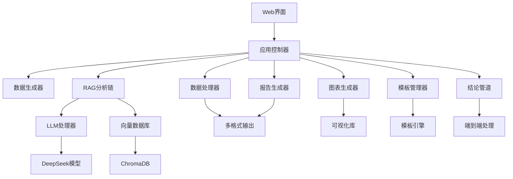

# CMS振动分析报告系统

[](https://github.com/your-repo/cms-vibration-rag)
[](https://python.org)
[](LICENSE)
[](https://streamlit.io)

基于RAG（检索增强生成）技术的风电机组状态监测系统（CMS）振动分析报告自动生成平台。支持多种模型部署方式，包括完全离线部署。

## 🆕 最新更新 (v2.1.0)

- ✅ **模板管理系统**: 新增完整的报告模板管理功能，支持版本控制和搜索
- ✅ **结论润色功能**: 集成LLM结论润色，提升报告质量和专业性
- ✅ **图文组合生成**: 自动关联图表与分析文本，生成专业报告
- ✅ **多格式报告**: 支持PDF、DOCX、HTML三种格式的报告输出
- ✅ **端到端管道**: 完整的从API结论到最终报告的处理流程
- ✅ **系统集成测试**: 全面的功能测试覆盖，确保系统稳定性
- ✅ **统一配置管理**: 新增`config.yaml`统一配置文件，支持所有自定义设置
- ✅ **多模型支持**: 支持OpenAI API、本地模型、DeepSeek API和自定义API端点
- ✅ **完全离线部署**: 支持本地模型和嵌入模型的完全离线运行
- ✅ **智能对话界面**: 集成聊天功能的新版Streamlit界面
- 🔧 **架构优化**: 模块化设计，更好的可扩展性和维护性

## 🚀 功能特性

### 核心功能
- **智能振动分析**: 支持多种大语言模型的振动数据智能分析
- **知识库检索**: 集成专业振动分析知识库，提供精准的故障诊断参考
- **模板管理系统**: 完整的报告模板管理，支持创建、版本控制、搜索和导入导出
- **结论润色处理**: 基于LLM的API结论智能润色，提升报告专业性
- **智能对话**: 自然语言交互，支持多轮对话和上下文理解
- **多格式报告**: 支持PDF、DOCX、HTML三种格式的专业分析报告生成
- **图文组合生成**: 自动关联振动图表与分析文本，生成专业报告
- **可视化图表**: 自动生成时域波形、频谱图、趋势图等专业图表
- **端到端管道**: 完整的从原始数据到最终报告的自动化处理流程
- **实时监测**: 支持多风场、多机组的实时振动数据监测

### 技术特点
- **RAG架构**: 结合向量数据库和大语言模型，提供准确的专业分析
- **多模型支持**: 支持OpenAI、本地模型、DeepSeek等多种模型部署方式
- **完全离线**: 支持完全离线部署，无需外部API依赖
- **模板引擎**: 强大的模板系统，支持变量替换和版本管理
- **智能管道**: 端到端的数据处理管道，从API到报告的全自动化
- **统一配置**: 所有配置集中管理，支持环境变量和热重载
- **模块化设计**: 清晰的代码架构，易于扩展和维护
- **全面测试**: 完整的集成测试覆盖，确保系统稳定性
- **用户友好**: 基于Streamlit的直观Web界面，集成聊天功能
- **高性能**: 优化的数据处理和模型推理流程

## 📁 项目结构

```
cms_vibration_rag/
├── config.yaml              # 🆕 统一配置文件
├── streamlit_app.py         # 🆕 新版Streamlit应用
├── app.py                   # 原版应用程序
├── requirements.txt         # 依赖包列表
├── README.md               # 项目说明
├── config/                 # 配置模块
│   ├── __init__.py
│   ├── config_loader.py    # 🆕 配置加载器
│   ├── settings.py         # 系统配置
│   └── prompts.py          # 提示词模板
├── chat/                   # 🆕 对话模块
│   ├── __init__.py
│   ├── chat_manager.py     # 对话管理器
│   ├── llm_client.py       # LLM客户端
│   ├── session_manager.py  # 会话管理
│   └── interface.py        # 对话界面
├── knowledge/              # 🆕 知识库模块
│   ├── __init__.py
│   ├── knowledge_retriever.py  # 知识检索器
│   ├── document_processor.py   # 文档处理器
│   └── template_manager.py     # 模板管理器
├── api/                    # 🆕 API模块
│   ├── __init__.py
│   ├── client.py           # API客户端
│   └── data_fetcher.py     # 数据获取器
├── database/               # 🆕 数据库模块
│   ├── __init__.py
│   ├── models.py           # 数据模型
│   └── repository.py       # 数据仓库
├── data/                   # 数据模块
│   ├── __init__.py
│   ├── mock_data.py        # 模拟数据生成
│   ├── templates/          # 报告模板
│   └── vector_db/          # 向量数据库
├── rag/                    # RAG核心模块
│   ├── __init__.py
│   ├── llm_handler.py      # LLM处理器
│   ├── vector_store.py     # 向量数据库
│   └── chain.py            # 分析链
├── utils/                  # 工具模块
│   ├── __init__.py
│   ├── chart_generator.py  # 图表生成器
│   └── data_processor.py   # 数据处理器
└── report/                 # 报告模块
    ├── __init__.py
    └── generator.py        # 报告生成器
│   └── chain.py             # RAG链条
├── utils/                   # 工具模块
│   ├── __init__.py
│   ├── data_processor.py    # 数据处理
│   └── chart_generator.py   # 图表生成
├── report/                  # 报告生成
│   ├── __init__.py
│   └── generator.py         # 报告生成器
└── logs/                    # 日志文件
```

## 🛠️ 安装部署

### 环境要求
- Python 3.12 (当前环境版本)
- CUDA 12.6+ (GPU推理，已配置)
- 内存: 16GB+ (推荐)
- 存储: 20GB+ (模型文件)
- 操作系统: Linux (当前为Ubuntu/CentOS兼容)

### 快速安装

1. **克隆项目**
```bash
git clone <repository-url>
cd cms_vibration_rag
```

2. **创建虚拟环境**
```bash
python -m venv venv
source venv/bin/activate  # Linux/Mac
# 或
venv\Scripts\activate     # Windows
```

3. **安装依赖**
```bash
# 精确版本安装，确保环境一致性
pip install -r requirements.txt

# 验证关键依赖安装
pip show streamlit torch transformers weasyprint
```

4. **配置系统**
```bash
# 配置文件已存在，可直接使用或根据需要修改
ls -la config.yaml

# 检查模型路径配置
grep -A 5 "model_path" config.yaml
```

5. **验证环境**
```bash
# 快速验证核心依赖
python -c "import streamlit, torch, transformers, weasyprint; print('✅ 核心依赖正常')"

# 检查CUDA支持
python -c "import torch; print(f'CUDA可用: {torch.cuda.is_available()}')"
```

6. **启动应用**
```bash
# 新版界面（推荐）
streamlit run streamlit_app.py --server.port 8501 --server.address 0.0.0.0

# 或使用原版界面
streamlit run app.py
```

7. **访问应用**
```bash
# 本地访问
http://localhost:8501

# 网络访问（如果配置了外部访问）
http://your-server-ip:8501
```

## ⚙️ 配置管理

### 统一配置文件 (config.yaml)

系统使用 `config.yaml` 作为统一配置文件，支持所有自定义设置：

```yaml
# 模型配置
model:
  type: "local"  # local, openai, deepseek_api, custom
  local:
    model_path: "/root/autodl-tmp/models/deepseek-7b"
    device: "auto"  # auto, cuda, cpu
  openai:
    api_key: "your-openai-api-key"
    base_url: "https://api.openai.com/v1"
    model_name: "gpt-3.5-turbo"

# 嵌入模型配置
embedding:
  type: "huggingface"  # huggingface, openai, local
  huggingface:
    model_name: "sentence-transformers/all-MiniLM-L6-v2"
    cache_dir: "/root/autodl-tmp/models/embeddings"

# Streamlit界面配置
streamlit:
  enabled: true
  server:
    port: 8501
    host: "0.0.0.0"
```

### 环境变量覆盖

支持通过环境变量动态配置：

```bash
# 模型配置
export CMS_MODEL_TYPE="openai"
export CMS_OPENAI_API_KEY="your-api-key"
export CMS_LOCAL_MODEL_PATH="/path/to/model"

# 数据库配置
export CMS_DB_TYPE="postgresql"
export CMS_DB_HOST="localhost"
export CMS_DB_PASSWORD="your-password"

# 系统配置
export CMS_LOG_LEVEL="DEBUG"
export CMS_DEBUG="true"
```

## 🚀 部署方案

### 1. 完全离线部署（推荐）

适用于无法访问外部API的环境：

```yaml
# config.yaml 离线配置
model:
  type: "local"
  local:
    model_path: "/root/autodl-tmp/models/deepseek-7b"
    device: "auto"
    load_in_8bit: true  # 节省内存

embedding:
  type: "huggingface"
  huggingface:
    model_name: "sentence-transformers/all-MiniLM-L6-v2"
    cache_dir: "/root/autodl-tmp/models/embeddings"

external_api:
  enabled: false  # 禁用外部API

development:
  use_mock_data: true  # 使用模拟数据
```

**部署步骤：**

1. 下载本地模型
```bash
# 下载DeepSeek-7B模型
huggingface-cli download deepseek-ai/deepseek-llm-7b-chat --local-dir /root/autodl-tmp/models/deepseek-7b

# 下载嵌入模型
python -c "from sentence_transformers import SentenceTransformer; SentenceTransformer('sentence-transformers/all-MiniLM-L6-v2', cache_folder='/root/autodl-tmp/models/embeddings')"
```

2. 配置离线模式
```bash
# 设置环境变量
export CMS_MODEL_TYPE="local"
export CMS_LOCAL_MODEL_PATH="/root/autodl-tmp/models/deepseek-7b"
export CMS_EMBEDDING_CACHE_DIR="/root/autodl-tmp/models/embeddings"
export CMS_EXTERNAL_API_ENABLED="false"
```

3. 启动系统
```bash
streamlit run streamlit_app.py --server.port 8501 --server.address 0.0.0.0
```

### 2. OpenAI API部署

适用于有网络连接且希望使用OpenAI模型的环境：

```yaml
# config.yaml OpenAI配置
model:
  type: "openai"
  openai:
    api_key: "your-openai-api-key-here"
    base_url: "https://api.openai.com/v1"
    model_name: "gpt-3.5-turbo"
    max_tokens: 4096
    temperature: 0.7

embedding:
  type: "openai"
  openai:
    api_key: "your-openai-api-key-here"
    model_name: "text-embedding-ada-002"
```

### 3. 混合部署

本地嵌入模型 + 云端LLM：

```yaml
model:
  type: "openai"  # 使用云端LLM
  openai:
    api_key: "your-api-key"

embedding:
  type: "huggingface"  # 使用本地嵌入模型
  huggingface:
    model_name: "sentence-transformers/all-MiniLM-L6-v2"
```

### 4. 自定义API端点

适用于使用自部署的模型服务：

```yaml
model:
  type: "custom"
  custom:
    api_key: "your-custom-api-key"
    base_url: "http://your-model-server:8000/v1"
    model_name: "your-custom-model"
    headers:
      Authorization: "Bearer your-token"
      User-Agent: "CMS-RAG-System"
```

## 📖 使用指南

### 新版界面使用

1. **启动系统**
```bash
streamlit run streamlit_app.py
```

2. **智能对话**
   - 在"智能对话"标签页与AI助手交互
   - 支持自然语言查询："生成华能风场A的A01风机振动分析报告"
   - 支持多轮对话和上下文理解

3. **数据分析**
   - 选择风场和风机
   - 生成振动数据和图表
   - 查看实时分析结果

4. **报告生成**
   - 配置报告参数
   - 选择报告类型和格式
   - 一键生成专业报告

5. **系统配置**
   - 在线编辑配置参数
   - 实时重载配置
   - 监控系统状态

### 配置热重载

系统支持运行时重新加载配置：

```python
# 在代码中重载配置
from config.config_loader import reload_config
reload_config()

# 或在界面中点击"重新加载配置"按钮
```

## 🔧 高级配置

### 性能优化配置

```yaml
# 内存优化
model:
  local:
    load_in_8bit: true    # 8位量化，节省内存
    load_in_4bit: false   # 4位量化，更省内存但可能影响质量
    device: "cuda"        # 强制使用GPU

# 缓存配置
system:
  cache:
    enabled: true
    type: "memory"        # memory, redis, file
    ttl: 3600            # 缓存过期时间(秒)
    max_size: 1000       # 最大缓存条目数

# 并发配置
streamlit:
  server:
    max_upload_size: 200  # MB
    enable_cors: false
    enable_xsrf_protection: true
```

### 安全配置

```yaml
security:
  # API密钥加密
  encrypt_api_keys: true
  encryption_key: "your-encryption-key-here"
  
  # 文件上传限制
  file_upload:
    max_size: 100  # MB
    allowed_types: [".pdf", ".docx", ".txt", ".md"]
    scan_virus: false
  
  # 访问控制
  access_control:
    enabled: false
    allowed_ips: ["127.0.0.1", "localhost"]
    rate_limit: 100  # 每分钟请求数限制
```

### 业务配置

```yaml
business:
  # 自定义风场配置
  wind_farms:
    "您的风场名称":
      turbines: ["T01", "T02", "T03"]
      location: "风场位置"
      capacity: "机组容量"
  
  # 自定义测点配置
  measurement_points:
    - "1X水平振动"
    - "1Y垂直振动"
    - "自定义测点"
  
  # 自定义报警阈值
  vibration:
    alarm_levels:
      正常: [0, 2.5]
      注意: [2.5, 6.3]
      警告: [6.3, 10.0]
      危险: [10.0, 999999]
```

### 开发配置

```python
# 开发模式配置
MODEL_CONFIG = {
    "model_name": "deepseek-ai/deepseek-llm-7b-chat",
    "model_path": "/path/to/model",
    "device": "auto",  # auto, cpu, cuda
    "max_length": 4096,
    "temperature": 0.7
}
```

### 风场配置
```python
WIND_FARM_CONFIG = {
    "华能风场A": {
        "location": "内蒙古",
        "capacity": "200MW",
        "turbines": ["A01", "A02", "A03"]
    }
}
```

### CMS配置
```python
CMS_CONFIG = {
    "measurement_points": [
        "主轴承DE", "主轴承NDE", "齿轮箱HSS", "发电机DE"
    ],
    "sampling_rate": 25600,
    "frequency_range": [0, 12800],
    "alarm_levels": {
        "正常": [0, 2.8],
        "注意": [2.8, 7.1],
        "报警": [7.1, 18.0]
    }
}
```

## 🎯 核心模块说明

### RAG模块
- **LLM Handler**: 管理DeepSeek模型的加载和推理
- **Vector Store**: 基于ChromaDB的向量知识库
- **Analysis Chain**: 整合检索和生成的分析链条

### 数据处理
- **时域分析**: RMS、峰值、峭度等统计特征
- **频域分析**: FFT、功率谱密度、主频率识别
- **包络分析**: 轴承故障特征提取
- **阶次分析**: 转速相关故障诊断

### 图表生成
- **时域波形**: 振动信号时间序列图
- **频谱图**: 频域分析结果
- **瀑布图**: 时频分析可视化
- **趋势图**: 长期监测趋势
- **设备总览**: 多测点综合展示

### 报告生成
- **PDF报告**: 专业格式，适合打印和存档
- **Word报告**: 可编辑格式，便于修改
- **HTML报告**: 网页格式，便于分享

## 🚨 故障排除

### 常见问题

1. **模型加载失败**
   ```bash
   # 检查模型路径
   ls -la /root/autodl-tmp/models/deepseek-7b/
   
   # 检查内存使用
   free -h
   
   # 检查CUDA环境
   nvidia-smi
   python -c "import torch; print(f'CUDA可用: {torch.cuda.is_available()}')"
   ```
   **解决方案**:
   - 确保模型路径正确: `/root/autodl-tmp/models/deepseek-7b`
   - 至少需要16GB内存用于模型加载
   - GPU模式需要CUDA 12.6+支持

2. **依赖包安装失败**
   ```bash
   # 更新pip和setuptools
   pip install --upgrade pip setuptools wheel
   
   # 使用国内镜像源
   pip install -i https://pypi.tuna.tsinghua.edu.cn/simple/ -r requirements.txt
   
   # 分步安装核心依赖
   pip install torch transformers streamlit
   pip install chromadb sentence-transformers
   pip install reportlab python-docx weasyprint
   ```
   **常见错误**:
   - `weasyprint`安装失败: 需要系统级依赖 `sudo apt-get install libpango-1.0-0 libharfbuzz0b libpangoft2-1.0-0`
   - `torch`版本冲突: 使用 `pip install torch --upgrade --force-reinstall`

3. **图表显示异常**
   ```bash
   # 检查matplotlib配置
   python -c "import matplotlib; print(matplotlib.get_backend())"
   
   # 测试中文字体
   python test_chinese_font.py
   
   # 检查字体文件
   fc-list :lang=zh
   ```
   **解决方案**:
   - 安装中文字体: `sudo apt-get install fonts-wqy-zenhei`
   - 设置matplotlib后端: `export MPLBACKEND=Agg`
   - 清除matplotlib缓存: `rm -rf ~/.cache/matplotlib`

4. **报告生成失败**
   ```bash
   # 检查输出目录权限
   ls -la output/
   chmod 755 output/
   
   # 测试PDF生成
   python -c "from reportlab.pdfgen import canvas; print('ReportLab正常')"
   
   # 测试Word生成
   python -c "from docx import Document; print('python-docx正常')"
   ```
   **解决方案**:
   - 确保输出目录存在且有写权限
   - 检查磁盘空间: `df -h`
   - 重新安装报告生成库: `pip install --upgrade reportlab python-docx`

5. **Streamlit启动失败**
   ```bash
   # 检查端口占用
   netstat -tlnp | grep 8501
   
   # 使用不同端口启动
   streamlit run streamlit_app.py --server.port 8502
   
   # 检查配置文件
   streamlit config show
   ```
   **解决方案**:
   - 更换端口或杀死占用进程
   - 检查防火墙设置
   - 清除streamlit缓存: `streamlit cache clear`

6. **内存不足错误**
   ```bash
   # 监控内存使用
   watch -n 1 'free -h && ps aux --sort=-%mem | head -10'
   
   # 启用模型量化
   export CMS_MODEL_LOAD_IN_8BIT=true
   
   # 减少批处理大小
   export CMS_BATCH_SIZE=1
   ```
   **解决方案**:
   - 启用8位量化减少内存使用
   - 使用CPU模式: `export CMS_MODEL_DEVICE=cpu`
   - 增加系统交换空间

### 日志调试

```bash
# 启用详细日志
export CMS_LOG_LEVEL=DEBUG

# 查看实时日志
tail -f logs/cms_system.log

# 检查错误日志
grep -i error logs/cms_system.log
```

### 性能优化

1. **GPU加速配置**
   ```yaml
   # config.yaml
   model:
     local:
       device: "cuda"  # 强制使用GPU
       torch_dtype: "float16"  # 使用半精度
       device_map: "auto"  # 自动设备映射
   ```
   ```bash
   # 验证GPU加速
   python -c "import torch; print(f'GPU数量: {torch.cuda.device_count()}')"
   nvidia-smi
   ```

2. **内存优化策略**
   ```yaml
   # 启用量化
   model:
     local:
       load_in_8bit: true    # 8位量化，节省50%内存
       load_in_4bit: false   # 4位量化，节省75%内存
       low_cpu_mem_usage: true
   
   # 缓存管理
   system:
     cache:
       max_memory_usage: "8GB"
       cleanup_interval: 3600  # 1小时清理一次
   ```
   ```bash
   # 监控内存使用
   python -c "
   import psutil
   import torch
   print(f'系统内存: {psutil.virtual_memory().percent}%')
   if torch.cuda.is_available():
       print(f'GPU内存: {torch.cuda.memory_allocated()/1024**3:.1f}GB')
   "
   ```

3. **并发处理优化**
   ```yaml
   # 并发配置
   system:
     workers: 4  # 工作进程数
     max_concurrent_requests: 10
     request_timeout: 300  # 5分钟超时
   
   streamlit:
     server:
       max_upload_size: 200
       enable_websocket_compression: true
   ```
   ```python
   # 异步处理示例
   import asyncio
   from concurrent.futures import ThreadPoolExecutor
   
   async def process_multiple_reports(data_list):
       with ThreadPoolExecutor(max_workers=4) as executor:
           tasks = [executor.submit(generate_report, data) for data in data_list]
           results = await asyncio.gather(*[asyncio.wrap_future(task) for task in tasks])
       return results
   ```

4. **数据库优化**
   ```yaml
   # 向量数据库优化
   chromadb:
     persist_directory: "/root/autodl-tmp/cms_vibration_rag/data/vector_db"
     collection_metadata: {"hnsw:space": "cosine", "hnsw:M": 16}
     batch_size: 100
   ```

5. **网络优化**
   ```bash
   # 启用gzip压缩
   export STREAMLIT_SERVER_ENABLE_CORS=false
   export STREAMLIT_SERVER_ENABLE_XSRF_PROTECTION=true
   
   # 使用CDN加速静态资源
   streamlit run app.py --server.enableCORS false --server.enableXsrfProtection true
   ```

### 生产环境部署

1. **Docker部署**
   ```dockerfile
   FROM python:3.12-slim
   
   # 安装系统依赖
   RUN apt-get update && apt-get install -y \
       libpango-1.0-0 libharfbuzz0b libpangoft2-1.0-0 \
       fonts-wqy-zenhei && rm -rf /var/lib/apt/lists/*
   
   # 复制项目文件
   COPY . /app
   WORKDIR /app
   
   # 安装Python依赖
   RUN pip install -r requirements.txt
   
   # 暴露端口
   EXPOSE 8501
   
   # 启动命令
   CMD ["streamlit", "run", "streamlit_app.py", "--server.port=8501", "--server.address=0.0.0.0"]
   ```

2. **Nginx反向代理**
   ```nginx
   server {
       listen 80;
       server_name your-domain.com;
       
       location / {
           proxy_pass http://localhost:8501;
           proxy_http_version 1.1;
           proxy_set_header Upgrade $http_upgrade;
           proxy_set_header Connection "upgrade";
           proxy_set_header Host $host;
           proxy_set_header X-Real-IP $remote_addr;
           proxy_set_header X-Forwarded-For $proxy_add_x_forwarded_for;
           proxy_set_header X-Forwarded-Proto $scheme;
       }
   }
   ```

3. **系统服务配置**
   ```ini
   # /etc/systemd/system/cms-vibration.service
   [Unit]
   Description=CMS Vibration Analysis System
   After=network.target
   
   [Service]
   Type=simple
   User=cms
   WorkingDirectory=/opt/cms_vibration_rag
   Environment=PATH=/opt/cms_vibration_rag/venv/bin
   ExecStart=/opt/cms_vibration_rag/venv/bin/streamlit run streamlit_app.py
   Restart=always
   RestartSec=10
   
   [Install]
   WantedBy=multi-user.target
   ```
   ```bash
   # 启用服务
   sudo systemctl enable cms-vibration
   sudo systemctl start cms-vibration
   sudo systemctl status cms-vibration
   ```

## 🧪 系统测试

### 集成测试

系统提供了完整的集成测试套件，验证所有核心功能：

```bash
# 运行完整的系统集成测试
python test_system_integration.py
```

测试覆盖的功能模块：
- ✅ **模板管理器**: 模板创建、版本控制、搜索功能
- ✅ **模板API**: API接口和统计功能
- ✅ **知识检索器**: 知识库初始化和检索
- ✅ **对话管理器**: LLM结论润色功能
- ✅ **图表生成器**: 时域/频域图表和图文组合
- ✅ **报告生成器**: 多格式报告生成
- ✅ **结论管道**: 端到端处理流程

### 测试结果示例

```
==================================================
测试结果汇总
==================================================

总测试数: 7
通过测试: 7
失败测试: 0
成功率: 100.0%

详细结果:
  template_manager: ✅ 通过
  template_api: ✅ 通过
  knowledge_retriever: ✅ 通过
  chat_manager: ✅ 通过
  chart_generator: ✅ 通过
  report_generator: ✅ 通过
  conclusion_pipeline: ✅ 通过

🎉 所有测试通过！系统功能正常
```

### 单元测试

各模块也支持独立测试：

```bash
# 测试模板管理功能
python -m knowledge.template_manager

# 测试图表生成功能
python -m utils.chart_generator

# 测试报告生成功能
python -m report.generator
```

### 测试数据

测试使用模拟的振动分析数据：
- 时域信号数据
- 频域谱分析结果
- 轴承故障特征
- 多种报警级别场景

## 📊 系统架构



## 🤝 贡献指南

欢迎贡献代码和建议！请遵循以下步骤：

1. Fork 项目
2. 创建特性分支 (`git checkout -b feature/AmazingFeature`)
3. 提交更改 (`git commit -m 'Add some AmazingFeature'`)
4. 推送到分支 (`git push origin feature/AmazingFeature`)
5. 开启 Pull Request

### 代码规范
- 使用 Black 进行代码格式化
- 遵循 PEP 8 编码规范
- 添加适当的注释和文档字符串
- 编写单元测试

## 📄 许可证

本项目采用 MIT 许可证 - 查看 [LICENSE](LICENSE) 文件了解详情。

## 📞 联系方式

- 项目维护者: [Your Name]
- 邮箱: [your.email@example.com]
- 项目地址: [GitHub Repository URL]

## 📋 版本历史

### v2.0.0 (2025-08-05)
- ✅ **振动数据可视化系统完全修复**
  - 修复KeyError: 'rms_value'访问错误
  - 解决PlotlyError图表显示问题
  - 添加sampling_rate字段到数据结构
  - 优化时间序列数据类型处理
  - 改进中文字体配置和错误处理
- ✅ **类型注解和代码质量提升**
  - 修复所有类型不匹配错误
  - 添加Optional类型支持
  - 完善错误处理机制
- ✅ **依赖项管理优化**
  - 添加SQLAlchemy数据库支持
  - 集成HTTPX异步HTTP客户端
  - 更新所有依赖包版本
- ✅ **系统稳定性增强**
  - 完善异常处理和日志记录
  - 优化内存使用和性能
  - 增强错误恢复能力

### v1.1.0 (2025-08-03)
- 修复智能分析结果显示问题
- 新增"注意"状态支持和UI优化
- 完善故障诊断和建议生成功能
- 优化数据概览页面统计显示
- 增强系统异常处理和稳定性
- 更新依赖包和开发工具

### v1.0.0 (2025-08-01)
- 初始版本发布
- 基础RAG分析功能
- 多格式报告生成
- Web界面和可视化
- 模拟数据生成

## 🚀 Git版本控制指南

### 初始化Git仓库
```bash
# 进入项目目录
cd cms_vibration_rag

# 初始化Git仓库
git init

# 添加所有文件
git add .

# 提交初始版本
git commit -m "feat: 初始版本发布 v1.1.0

- 完整的CMS振动分析系统
- 基于RAG的智能分析功能
- 多格式报告生成
- Web界面和数据可视化
- 修复智能分析显示问题
- 新增注意状态支持"
```

### 连接远程仓库
```bash
# 添加远程仓库
git remote add origin <your-repository-url>

# 推送到远程仓库
git push -u origin main
```

### 创建版本标签
```bash
# 创建版本标签
git tag -a v1.1.0 -m "版本 1.1.0 - 修复智能分析和状态处理"

# 推送标签到远程
git push origin v1.1.0
```

### 日常开发流程
```bash
# 创建新功能分支
git checkout -b feature/new-feature

# 开发完成后提交
git add .
git commit -m "feat: 添加新功能"

# 合并到主分支
git checkout main
git merge feature/new-feature

# 推送更新
git push origin main
```

## 📚 文档资源

### 使用指南
- **[模板使用指南](TEMPLATE_GUIDE.md)** - 详细的模板上传、格式规范和使用方法
- **[测试指南](TESTING.md)** - 完整的测试套件使用说明和故障排除
- **[扩展计划](EXPANSION_PLAN.md)** - 系统功能扩展规划和开发路线图

### 快速链接
- **模板管理**: 支持自定义报告模板，版本控制和搜索功能
- **集成测试**: 一键运行完整测试套件，验证系统功能
- **API文档**: 详细的接口说明和使用示例
- **故障排除**: 常见问题解决方案和性能优化建议

## 🙏 致谢

感谢以下开源项目的支持：
- [DeepSeek](https://github.com/deepseek-ai/DeepSeek-LLM)
- [Streamlit](https://streamlit.io/)
- [ChromaDB](https://www.trychroma.com/)
- [Transformers](https://huggingface.co/transformers/)
- [Matplotlib](https://matplotlib.org/)
- [ReportLab](https://www.reportlab.com/)

---

**注意**: 本系统仅供学习和研究使用，实际工程应用请根据具体需求进行适配和验证。
