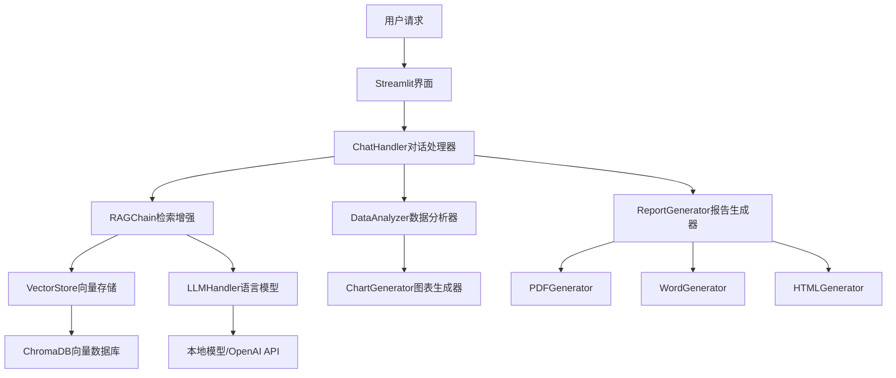

# CMS振动分析报告系统 - 技术实现文档

## 文档概述

本文档面向技术开发人员，详细阐述CMS振动分析报告系统的技术架构、核心算法、实现思路和开发方法。通过本文档，开发者可以深入理解系统的技术细节，并能够进行二次开发、功能扩展和性能优化。

**文档版本**: v2.1.0  
**更新日期**: 2025-01-16  
**适用人员**: 后端开发工程师、算法工程师、系统架构师  

---

## 1. 系统架构设计

### 1.1 整体架构

系统采用模块化分层架构，主要包含以下核心层次：

```
┌─────────────────────────────────────────────────────────────┐
│                    用户界面层 (UI Layer)                      │
├─────────────────────────────────────────────────────────────┤
│  Streamlit Web界面  │  Gradio备用界面  │  FastAPI REST接口  │
├─────────────────────────────────────────────────────────────┤
│                   业务逻辑层 (Business Layer)                │
├─────────────────────────────────────────────────────────────┤
│  对话管理  │  数据分析  │  报告生成  │  知识检索  │  配置管理  │
├─────────────────────────────────────────────────────────────┤
│                    核心服务层 (Core Layer)                   │
├─────────────────────────────────────────────────────────────┤
│   RAG引擎   │  LLM处理器  │  向量存储  │  图表生成  │  文档处理  │
├─────────────────────────────────────────────────────────────┤
│                   数据访问层 (Data Layer)                    │
├─────────────────────────────────────────────────────────────┤
│  ChromaDB  │  SQLAlchemy  │  文件系统  │  模型存储  │  缓存系统  │
└─────────────────────────────────────────────────────────────┘
```

### 1.2 核心组件关系



### 1.3 技术栈选型

| 技术领域 | 选型 | 理由 |
|---------|------|------|
| **Web框架** | Streamlit + FastAPI | Streamlit快速原型，FastAPI高性能API |
| **深度学习** | PyTorch + Transformers | 生态完善，模型丰富 |
| **向量数据库** | ChromaDB | 轻量级，易部署，性能优秀 |
| **文档生成** | ReportLab + python-docx | PDF/Word专业生成 |
| **数据处理** | Pandas + NumPy + SciPy | 科学计算标准库 |
| **可视化** | Matplotlib + Plotly | 静态+交互式图表 |
| **配置管理** | YAML + Pydantic | 类型安全的配置 |

---

## 2. 核心算法实现

### 2.1 RAG (检索增强生成) 算法

#### 2.1.1 算法流程

```python
def rag_process(query: str) -> str:
    """
    RAG核心算法实现
    
    Args:
        query: 用户查询
        
    Returns:
        增强后的回答
    """
    # 1. 查询预处理
    processed_query = preprocess_query(query)
    
    # 2. 向量化查询
    query_embedding = embedding_model.encode(processed_query)
    
    # 3. 相似性检索
    similar_docs = vector_store.similarity_search(
        query_embedding, 
        k=config.retrieval.top_k
    )
    
    # 4. 上下文构建
    context = build_context(similar_docs, query)
    
    # 5. 提示词构建
    prompt = build_prompt(context, query)
    
    # 6. LLM生成
    response = llm_handler.generate(prompt)
    
    # 7. 后处理
    final_response = postprocess_response(response)
    
    return final_response
```

#### 2.1.2 向量检索优化

**多级检索策略**:
```python
class MultiLevelRetrieval:
    def __init__(self):
        self.dense_retriever = DenseRetriever()  # 密集向量检索
        self.sparse_retriever = SparseRetriever()  # 稀疏向量检索
        self.hybrid_ranker = HybridRanker()  # 混合排序
    
    def retrieve(self, query: str, k: int = 10):
        # 密集检索
        dense_results = self.dense_retriever.search(query, k*2)
        
        # 稀疏检索
        sparse_results = self.sparse_retriever.search(query, k*2)
        
        # 混合排序
        final_results = self.hybrid_ranker.rank(
            dense_results, sparse_results, k
        )
        
        return final_results
```

**语义分块策略**:
```python
def semantic_chunking(text: str, max_chunk_size: int = 512) -> List[str]:
    """
    基于语义的智能分块
    """
    sentences = split_sentences(text)
    chunks = []
    current_chunk = ""
    current_embedding = None
    
    for sentence in sentences:
        sentence_embedding = get_embedding(sentence)
        
        if current_embedding is not None:
            similarity = cosine_similarity(current_embedding, sentence_embedding)
            
            # 语义相似度低或长度超限时分块
            if similarity < 0.7 or len(current_chunk + sentence) > max_chunk_size:
                chunks.append(current_chunk.strip())
                current_chunk = sentence
                current_embedding = sentence_embedding
            else:
                current_chunk += " " + sentence
                # 更新嵌入向量（加权平均）
                current_embedding = update_embedding(current_embedding, sentence_embedding)
        else:
            current_chunk = sentence
            current_embedding = sentence_embedding
    
    if current_chunk:
        chunks.append(current_chunk.strip())
    
    return chunks
```

### 2.2 智能图表匹配算法

#### 2.2.1 关键词匹配策略

```python
class SmartChartMatcher:
    def __init__(self):
        self.keyword_mappings = {
            '振动趋势': ['trend', 'vibration_trend', 'time_series'],
            '频谱分析': ['spectrum', 'frequency', 'fft'],
            '包络分析': ['envelope', 'demodulation'],
            '阶次分析': ['order', 'rpm', 'speed'],
            '瀑布图': ['waterfall', 'cascade'],
            '统计分析': ['statistics', 'rms', 'peak'],
            '相位分析': ['phase', 'bode'],
            '相关性分析': ['correlation', 'coherence'],
            '模态分析': ['modal', 'mode_shape'],
            '冲击分析': ['shock', 'transient']
        }
        
        self.chart_priorities = {
            'vibration_trend': 1,
            'spectrum': 2,
            'envelope': 3,
            'order': 4,
            'waterfall': 5
        }
    
    def match_charts(self, conclusions: List[str], available_charts: List[str]) -> List[Tuple[str, str]]:
        """
        智能匹配分析结论与图表
        
        Args:
            conclusions: 分析结论列表
            available_charts: 可用图表列表
            
        Returns:
            匹配结果 [(结论, 图表路径)]
        """
        matches = []
        used_charts = set()
        
        for conclusion in conclusions:
            best_chart = self._find_best_match(conclusion, available_charts, used_charts)
            if best_chart:
                matches.append((conclusion, best_chart))
                used_charts.add(best_chart)
            else:
                # 回退策略：使用索引匹配
                fallback_chart = self._fallback_match(len(matches), available_charts, used_charts)
                if fallback_chart:
                    matches.append((conclusion, fallback_chart))
                    used_charts.add(fallback_chart)
        
        return matches
    
    def _find_best_match(self, conclusion: str, charts: List[str], used: set) -> Optional[str]:
        """
        基于关键词的最佳匹配
        """
        conclusion_lower = conclusion.lower()
        best_score = 0
        best_chart = None
        
        for chart_path in charts:
            if chart_path in used:
                continue
                
            chart_name = os.path.basename(chart_path).lower()
            score = 0
            
            # 关键词匹配评分
            for keyword, chart_types in self.keyword_mappings.items():
                if keyword in conclusion_lower:
                    for chart_type in chart_types:
                        if chart_type in chart_name:
                            score += 10
                            # 优先级加权
                            if chart_type in self.chart_priorities:
                                score += (6 - self.chart_priorities[chart_type])
            
            # 文件名直接匹配
            for word in conclusion_lower.split():
                if len(word) > 2 and word in chart_name:
                    score += 5
            
            if score > best_score:
                best_score = score
                best_chart = chart_path
        
        return best_chart if best_score > 0 else None
```

#### 2.2.2 机器学习增强匹配

```python
class MLEnhancedMatcher:
    def __init__(self):
        self.text_encoder = SentenceTransformer('all-MiniLM-L6-v2')
        self.chart_features = self._load_chart_features()
    
    def _extract_chart_features(self, chart_path: str) -> np.ndarray:
        """
        提取图表特征向量
        """
        # 文件名特征
        filename_features = self.text_encoder.encode(os.path.basename(chart_path))
        
        # 图像特征（如果需要）
        # image_features = self._extract_image_features(chart_path)
        
        return filename_features
    
    def semantic_match(self, conclusion: str, chart_paths: List[str]) -> List[float]:
        """
        基于语义相似度的匹配
        """
        conclusion_embedding = self.text_encoder.encode(conclusion)
        
        similarities = []
        for chart_path in chart_paths:
            chart_features = self._extract_chart_features(chart_path)
            similarity = cosine_similarity(
                conclusion_embedding.reshape(1, -1),
                chart_features.reshape(1, -1)
            )[0][0]
            similarities.append(similarity)
        
        return similarities
```

### 2.3 多模态数据处理

#### 2.3.1 时域信号处理

```python
class TimeSeriesProcessor:
    def __init__(self, sampling_rate: float):
        self.fs = sampling_rate
    
    def extract_features(self, signal: np.ndarray) -> Dict[str, float]:
        """
        提取时域特征
        """
        features = {
            'rms': np.sqrt(np.mean(signal**2)),
            'peak': np.max(np.abs(signal)),
            'peak_to_peak': np.ptp(signal),
            'crest_factor': np.max(np.abs(signal)) / np.sqrt(np.mean(signal**2)),
            'kurtosis': scipy.stats.kurtosis(signal),
            'skewness': scipy.stats.skew(signal),
            'std': np.std(signal),
            'mean': np.mean(signal)
        }
        return features
    
    def detect_anomalies(self, signal: np.ndarray, threshold: float = 3.0) -> List[int]:
        """
        异常检测
        """
        # Z-score方法
        z_scores = np.abs(scipy.stats.zscore(signal))
        anomaly_indices = np.where(z_scores > threshold)[0]
        return anomaly_indices.tolist()
```

#### 2.3.2 频域分析算法

```python
class FrequencyAnalyzer:
    def __init__(self, sampling_rate: float):
        self.fs = sampling_rate
    
    def compute_spectrum(self, signal: np.ndarray, window: str = 'hann') -> Tuple[np.ndarray, np.ndarray]:
        """
        计算功率谱密度
        """
        frequencies, psd = scipy.signal.welch(
            signal, 
            fs=self.fs, 
            window=window,
            nperseg=len(signal)//8,
            overlap=0.5
        )
        return frequencies, psd
    
    def find_dominant_frequencies(self, frequencies: np.ndarray, psd: np.ndarray, n_peaks: int = 5) -> List[Tuple[float, float]]:
        """
        查找主导频率
        """
        peaks, properties = scipy.signal.find_peaks(
            psd, 
            height=np.max(psd) * 0.1,
            distance=len(psd)//20
        )
        
        # 按幅值排序
        peak_amplitudes = psd[peaks]
        sorted_indices = np.argsort(peak_amplitudes)[::-1]
        
        dominant_freqs = []
        for i in sorted_indices[:n_peaks]:
            freq = frequencies[peaks[i]]
            amplitude = peak_amplitudes[i]
            dominant_freqs.append((freq, amplitude))
        
        return dominant_freqs
```

---

## 3. 系统核心模块详解

### 3.1 RAG模块 (`rag/`)

#### 3.1.1 向量存储管理

```python
# rag/vector_store.py
class VectorStoreManager:
    def __init__(self, config: VectorStoreConfig):
        self.config = config
        self.client = chromadb.PersistentClient(path=config.persist_directory)
        self.collection = self._get_or_create_collection()
        self.embedding_model = self._load_embedding_model()
    
    def add_documents(self, documents: List[Document]) -> None:
        """
        批量添加文档到向量存储
        """
        texts = [doc.page_content for doc in documents]
        metadatas = [doc.metadata for doc in documents]
        ids = [f"doc_{i}_{hash(text)[:8]}" for i, text in enumerate(texts)]
        
        # 分批处理，避免内存溢出
        batch_size = self.config.batch_size
        for i in range(0, len(texts), batch_size):
            batch_texts = texts[i:i+batch_size]
            batch_metadatas = metadatas[i:i+batch_size]
            batch_ids = ids[i:i+batch_size]
            
            embeddings = self.embedding_model.encode(batch_texts)
            
            self.collection.add(
                embeddings=embeddings.tolist(),
                documents=batch_texts,
                metadatas=batch_metadatas,
                ids=batch_ids
            )
    
    def similarity_search(self, query: str, k: int = 10, filter_dict: Optional[Dict] = None) -> List[Document]:
        """
        相似性搜索
        """
        query_embedding = self.embedding_model.encode([query])
        
        results = self.collection.query(
            query_embeddings=query_embedding.tolist(),
            n_results=k,
            where=filter_dict
        )
        
        documents = []
        for i, (doc, metadata, distance) in enumerate(zip(
            results['documents'][0],
            results['metadatas'][0],
            results['distances'][0]
        )):
            metadata['similarity_score'] = 1 - distance  # 转换为相似度
            documents.append(Document(page_content=doc, metadata=metadata))
        
        return documents
```

#### 3.1.2 检索链实现

```python
# rag/retrieval_chain.py
class RetrievalChain:
    def __init__(self, vector_store: VectorStoreManager, llm_handler: LLMHandler):
        self.vector_store = vector_store
        self.llm_handler = llm_handler
        self.prompt_template = self._load_prompt_template()
    
    def invoke(self, query: str, **kwargs) -> Dict[str, Any]:
        """
        执行检索增强生成
        """
        # 1. 查询预处理
        processed_query = self._preprocess_query(query)
        
        # 2. 检索相关文档
        retrieved_docs = self.vector_store.similarity_search(
            processed_query, 
            k=kwargs.get('top_k', 5)
        )
        
        # 3. 构建上下文
        context = self._build_context(retrieved_docs)
        
        # 4. 生成回答
        prompt = self.prompt_template.format(
            context=context,
            question=query
        )
        
        response = self.llm_handler.generate(
            prompt,
            max_tokens=kwargs.get('max_tokens', 1000),
            temperature=kwargs.get('temperature', 0.7)
        )
        
        return {
            'answer': response,
            'source_documents': retrieved_docs,
            'context': context
        }
    
    def _build_context(self, documents: List[Document]) -> str:
        """
        构建上下文字符串
        """
        context_parts = []
        for i, doc in enumerate(documents, 1):
            source = doc.metadata.get('source', '未知来源')
            content = doc.page_content[:500]  # 限制长度
            context_parts.append(f"[参考资料{i}] 来源: {source}\n内容: {content}")
        
        return "\n\n".join(context_parts)
```

### 3.2 LLM处理模块 (`llm/`)

#### 3.2.1 模型管理器

```python
# llm/model_manager.py
class ModelManager:
    def __init__(self, config: ModelConfig):
        self.config = config
        self.model = None
        self.tokenizer = None
        self.device = self._get_device()
    
    def load_model(self) -> None:
        """
        加载模型和分词器
        """
        logger.info(f"Loading model: {self.config.model_name}")
        
        # 加载分词器
        self.tokenizer = AutoTokenizer.from_pretrained(
            self.config.model_path,
            trust_remote_code=True
        )
        
        # 配置量化
        quantization_config = None
        if self.config.quantization == '4bit':
            quantization_config = BitsAndBytesConfig(
                load_in_4bit=True,
                bnb_4bit_compute_dtype=torch.float16,
                bnb_4bit_use_double_quant=True,
                bnb_4bit_quant_type="nf4"
            )
        elif self.config.quantization == '8bit':
            quantization_config = BitsAndBytesConfig(load_in_8bit=True)
        
        # 加载模型
        self.model = AutoModelForCausalLM.from_pretrained(
            self.config.model_path,
            quantization_config=quantization_config,
            device_map="auto" if self.config.device == "auto" else None,
            torch_dtype=torch.float16,
            trust_remote_code=True
        )
        
        if self.config.device != "auto":
            self.model.to(self.device)
        
        logger.info("Model loaded successfully")
    
    def generate(self, prompt: str, **kwargs) -> str:
        """
        生成文本
        """
        if self.model is None:
            raise RuntimeError("Model not loaded. Call load_model() first.")
        
        # 编码输入
        inputs = self.tokenizer.encode(prompt, return_tensors="pt").to(self.device)
        
        # 生成参数
        generation_kwargs = {
            'max_new_tokens': kwargs.get('max_tokens', 1000),
            'temperature': kwargs.get('temperature', 0.7),
            'top_p': kwargs.get('top_p', 0.9),
            'do_sample': True,
            'pad_token_id': self.tokenizer.eos_token_id
        }
        
        # 生成文本
        with torch.no_grad():
            outputs = self.model.generate(inputs, **generation_kwargs)
        
        # 解码输出
        generated_text = self.tokenizer.decode(
            outputs[0][len(inputs[0]):], 
            skip_special_tokens=True
        )
        
        return generated_text.strip()
```

#### 3.2.2 提示词工程

```python
# llm/prompt_templates.py
class PromptTemplateManager:
    def __init__(self):
        self.templates = {
            'analysis': self._get_analysis_template(),
            'report': self._get_report_template(),
            'chat': self._get_chat_template()
        }
    
    def _get_analysis_template(self) -> str:
        return """
你是一位专业的振动分析工程师，具有丰富的设备故障诊断经验。

基于以下振动数据和参考资料，请进行专业的振动分析：

【参考资料】
{context}

【用户问题】
{question}

【分析要求】
1. 基于提供的参考资料进行分析
2. 结合振动分析的专业知识
3. 提供具体的故障诊断建议
4. 如果数据不足，请明确指出
5. 使用专业术语，但保持表达清晰

【回答格式】
请按以下格式组织回答：
- 数据概况：简述振动数据的基本情况
- 异常识别：指出发现的异常现象
- 故障分析：分析可能的故障原因
- 建议措施：提出具体的处理建议

请开始分析：
"""
    
    def _get_report_template(self) -> str:
        return """
你是一位资深的振动分析专家，需要生成专业的振动分析报告。

【数据信息】
{data_info}

【分析结果】
{analysis_results}

【报告要求】
请生成一份结构化的振动分析报告，包含以下部分：

1. **执行摘要**（100-150字）
   - 总体评估结论
   - 主要发现
   - 关键建议

2. **详细分析**（每个分析点150-200字）
   - 分析要点1：[根据数据特征确定]
   - 分析要点2：[根据数据特征确定]
   - 分析要点3：[根据数据特征确定]
   - 分析要点4：[根据数据特征确定]
   - 分析要点5：[根据数据特征确定]

3. **建议措施**（100-150字）
   - 短期措施
   - 长期建议
   - 监测要点

【格式要求】
- 使用专业术语，表达准确
- 结论明确，建议具体
- 每个分析要点独立成段
- 避免重复内容

请生成报告：
"""
```

### 3.3 数据分析模块 (`data/`)

#### 3.3.1 信号处理器

```python
# data/signal_processor.py
class SignalProcessor:
    def __init__(self, config: ProcessingConfig):
        self.config = config
        self.filters = self._initialize_filters()
    
    def process_vibration_data(self, data: np.ndarray, metadata: Dict) -> ProcessedData:
        """
        处理振动数据
        """
        fs = metadata.get('sampling_rate', 25600)
        
        # 1. 预处理
        cleaned_data = self._preprocess(data)
        
        # 2. 时域分析
        time_features = self._extract_time_features(cleaned_data, fs)
        
        # 3. 频域分析
        freq_features = self._extract_frequency_features(cleaned_data, fs)
        
        # 4. 包络分析
        envelope_features = self._extract_envelope_features(cleaned_data, fs)
        
        # 5. 阶次分析（如果有转速信息）
        order_features = None
        if 'rpm' in metadata:
            order_features = self._extract_order_features(cleaned_data, fs, metadata['rpm'])
        
        return ProcessedData(
            raw_data=data,
            processed_data=cleaned_data,
            time_features=time_features,
            frequency_features=freq_features,
            envelope_features=envelope_features,
            order_features=order_features,
            metadata=metadata
        )
    
    def _preprocess(self, data: np.ndarray) -> np.ndarray:
        """
        数据预处理
        """
        # 去除直流分量
        data = data - np.mean(data)
        
        # 异常值处理
        q1, q3 = np.percentile(data, [25, 75])
        iqr = q3 - q1
        lower_bound = q1 - 1.5 * iqr
        upper_bound = q3 + 1.5 * iqr
        
        # 限幅处理
        data = np.clip(data, lower_bound, upper_bound)
        
        # 滤波处理
        if self.config.enable_filtering:
            data = self._apply_filters(data)
        
        return data
    
    def _extract_time_features(self, data: np.ndarray, fs: float) -> Dict[str, float]:
        """
        提取时域特征
        """
        return {
            'rms': np.sqrt(np.mean(data**2)),
            'peak': np.max(np.abs(data)),
            'peak_to_peak': np.ptp(data),
            'crest_factor': np.max(np.abs(data)) / np.sqrt(np.mean(data**2)),
            'kurtosis': scipy.stats.kurtosis(data),
            'skewness': scipy.stats.skew(data),
            'variance': np.var(data),
            'energy': np.sum(data**2) / len(data)
        }
```

### 3.4 图表生成模块 (`charts/`)

#### 3.4.1 图表生成器基类

```python
# charts/base_generator.py
class BaseChartGenerator:
    def __init__(self, config: ChartConfig):
        self.config = config
        self._setup_matplotlib()
    
    def _setup_matplotlib(self):
        """
        配置matplotlib中文支持
        """
        # 设置中文字体
        plt.rcParams['font.sans-serif'] = ['SimHei', 'DejaVu Sans', 'Arial Unicode MS']
        plt.rcParams['axes.unicode_minus'] = False
        
        # 设置图表样式
        plt.style.use(self.config.style)
        
        # 设置DPI
        plt.rcParams['figure.dpi'] = self.config.dpi
        plt.rcParams['savefig.dpi'] = self.config.dpi
    
    def generate_chart(self, data: Any, chart_type: str, **kwargs) -> str:
        """
        生成图表的通用接口
        """
        method_name = f"_generate_{chart_type}"
        if hasattr(self, method_name):
            return getattr(self, method_name)(data, **kwargs)
        else:
            raise ValueError(f"Unsupported chart type: {chart_type}")
    
    def _save_chart(self, fig: plt.Figure, filename: str) -> str:
        """
        保存图表
        """
        filepath = os.path.join(self.config.output_dir, filename)
        fig.savefig(
            filepath,
            dpi=self.config.dpi,
            bbox_inches='tight',
            facecolor='white',
            edgecolor='none'
        )
        plt.close(fig)
        return filepath
```

#### 3.4.2 振动图表生成器

```python
# charts/vibration_generator.py
class VibrationChartGenerator(BaseChartGenerator):
    def _generate_time_series(self, data: ProcessedData, **kwargs) -> str:
        """
        生成时域波形图
        """
        fig, ax = plt.subplots(figsize=(12, 6))
        
        time_axis = np.arange(len(data.processed_data)) / data.metadata['sampling_rate']
        
        ax.plot(time_axis, data.processed_data, 'b-', linewidth=0.8)
        ax.set_xlabel('时间 (s)')
        ax.set_ylabel('振动幅值 (mm/s)')
        ax.set_title(f'{data.metadata.get("measurement_point", "测点")} - 时域波形')
        ax.grid(True, alpha=0.3)
        
        # 添加统计信息
        rms_value = data.time_features['rms']
        peak_value = data.time_features['peak']
        ax.text(0.02, 0.98, f'RMS: {rms_value:.3f}\nPeak: {peak_value:.3f}', 
                transform=ax.transAxes, verticalalignment='top',
                bbox=dict(boxstyle='round', facecolor='wheat', alpha=0.8))
        
        filename = f"time_series_{data.metadata.get('point_id', 'unknown')}.png"
        return self._save_chart(fig, filename)
    
    def _generate_spectrum(self, data: ProcessedData, **kwargs) -> str:
        """
        生成频谱图
        """
        fig, ax = plt.subplots(figsize=(12, 6))
        
        frequencies = data.frequency_features['frequencies']
        amplitudes = data.frequency_features['amplitudes']
        
        ax.semilogy(frequencies, amplitudes, 'r-', linewidth=1.0)
        ax.set_xlabel('频率 (Hz)')
        ax.set_ylabel('幅值 (mm/s)')
        ax.set_title(f'{data.metadata.get("measurement_point", "测点")} - 频谱分析')
        ax.grid(True, alpha=0.3)
        
        # 标记主要频率成分
        dominant_freqs = data.frequency_features.get('dominant_frequencies', [])
        for freq, amp in dominant_freqs[:5]:  # 显示前5个主要频率
            ax.annotate(f'{freq:.1f}Hz', xy=(freq, amp), 
                       xytext=(10, 10), textcoords='offset points',
                       bbox=dict(boxstyle='round,pad=0.3', facecolor='yellow', alpha=0.7),
                       arrowprops=dict(arrowstyle='->', connectionstyle='arc3,rad=0'))
        
        filename = f"spectrum_{data.metadata.get('point_id', 'unknown')}.png"
        return self._save_chart(fig, filename)
```

### 3.5 报告生成模块 (`report/`)

#### 3.5.1 智能报告生成器

```python
# report/smart_generator.py
class SmartReportGenerator:
    def __init__(self, config: ReportConfig):
        self.config = config
        self.chart_matcher = SmartChartMatcher()
        self.template_engine = Jinja2Environment()
    
    def generate_intelligent_report(self, analysis_data: AnalysisData) -> ReportResult:
        """
        生成智能报告
        """
        # 1. 生成分析结论
        conclusions = self._generate_conclusions(analysis_data)
        
        # 2. 生成图表
        chart_paths = self._generate_charts(analysis_data)
        
        # 3. 智能匹配
        matched_pairs = self.chart_matcher.match_charts(conclusions, chart_paths)
        
        # 4. 构建报告数据
        report_data = self._build_report_data(analysis_data, matched_pairs)
        
        # 5. 生成报告文件
        report_files = {}
        if 'pdf' in self.config.output_formats:
            report_files['pdf'] = self._generate_pdf_report(report_data)
        if 'html' in self.config.output_formats:
            report_files['html'] = self._generate_html_report(report_data)
        if 'docx' in self.config.output_formats:
            report_files['docx'] = self._generate_docx_report(report_data)
        
        return ReportResult(
            report_files=report_files,
            analysis_data=analysis_data,
            matched_pairs=matched_pairs
        )
    
    def _generate_conclusions(self, analysis_data: AnalysisData) -> List[str]:
        """
        基于数据生成分析结论
        """
        conclusions = []
        
        # 基于时域特征的结论
        if analysis_data.time_features['rms'] > self.config.rms_threshold:
            conclusions.append(f"设备整体振动水平较高，RMS值达到{analysis_data.time_features['rms']:.3f} mm/s，建议进一步检查。")
        
        # 基于频域特征的结论
        dominant_freqs = analysis_data.frequency_features.get('dominant_frequencies', [])
        if dominant_freqs:
            freq, amp = dominant_freqs[0]
            if freq < 100:  # 低频
                conclusions.append(f"检测到{freq:.1f}Hz主要频率成分，可能与不平衡或不对中相关。")
            elif 100 <= freq < 1000:  # 中频
                conclusions.append(f"检测到{freq:.1f}Hz频率成分，建议检查轴承状态。")
            else:  # 高频
                conclusions.append(f"检测到{freq:.1f}Hz高频成分，可能存在齿轮啮合问题。")
        
        # 基于包络分析的结论
        if analysis_data.envelope_features:
            envelope_peaks = analysis_data.envelope_features.get('peaks', [])
            if envelope_peaks:
                conclusions.append("包络分析显示存在冲击特征，建议重点关注轴承状态。")
        
        # 确保至少有5个结论
        while len(conclusions) < 5:
            conclusions.append(f"分析要点{len(conclusions)+1}：基于当前数据的补充分析。")
        
        return conclusions[:5]  # 限制为5个结论
```

---

## 4. 性能优化策略

### 4.1 内存优化

#### 4.1.1 模型量化

```python
# 4位量化配置
quantization_config = BitsAndBytesConfig(
    load_in_4bit=True,
    bnb_4bit_compute_dtype=torch.float16,
    bnb_4bit_use_double_quant=True,
    bnb_4bit_quant_type="nf4"
)

# 8位量化配置
quantization_config = BitsAndBytesConfig(
    load_in_8bit=True,
    llm_int8_enable_fp32_cpu_offload=True
)
```

#### 4.1.2 梯度检查点

```python
# 启用梯度检查点减少内存使用
model.gradient_checkpointing_enable()

# CPU卸载
model = AutoModelForCausalLM.from_pretrained(
    model_path,
    device_map="auto",
    offload_folder="./offload",
    offload_state_dict=True
)
```

### 4.2 计算优化

#### 4.2.1 批处理优化

```python
class BatchProcessor:
    def __init__(self, batch_size: int = 32):
        self.batch_size = batch_size
    
    def process_batch(self, items: List[Any]) -> List[Any]:
        results = []
        for i in range(0, len(items), self.batch_size):
            batch = items[i:i+self.batch_size]
            batch_results = self._process_single_batch(batch)
            results.extend(batch_results)
        return results
```

#### 4.2.2 并发处理

```python
import asyncio
from concurrent.futures import ThreadPoolExecutor

class ConcurrentProcessor:
    def __init__(self, max_workers: int = 4):
        self.executor = ThreadPoolExecutor(max_workers=max_workers)
    
    async def process_concurrent(self, tasks: List[Callable]) -> List[Any]:
        loop = asyncio.get_event_loop()
        futures = [loop.run_in_executor(self.executor, task) for task in tasks]
        results = await asyncio.gather(*futures)
        return results
```

### 4.3 缓存策略

#### 4.3.1 LRU缓存

```python
from functools import lru_cache
from typing import Tuple

class CachedEmbedding:
    def __init__(self, model):
        self.model = model
    
    @lru_cache(maxsize=1000)
    def encode_cached(self, text: str) -> Tuple[float, ...]:
        """
        缓存嵌入向量计算结果
        """
        embedding = self.model.encode(text)
        return tuple(embedding.tolist())  # 转换为可哈希类型
```

#### 4.3.2 Redis缓存

```python
import redis
import pickle

class RedisCache:
    def __init__(self, host='localhost', port=6379, db=0):
        self.redis_client = redis.Redis(host=host, port=port, db=db)
    
    def get(self, key: str) -> Any:
        data = self.redis_client.get(key)
        return pickle.loads(data) if data else None
    
    def set(self, key: str, value: Any, expire: int = 3600):
        self.redis_client.setex(key, expire, pickle.dumps(value))
```

---

## 5. 部署与运维

### 5.1 Docker部署

#### 5.1.1 Dockerfile

```dockerfile
# Dockerfile
FROM python:3.12-slim

# 安装系统依赖
RUN apt-get update && apt-get install -y \
    gcc g++ \
    libpango-1.0-0 libharfbuzz0b libpangoft2-1.0-0 \
    fonts-dejavu-core \
    && rm -rf /var/lib/apt/lists/*

# 设置工作目录
WORKDIR /app

# 复制依赖文件
COPY requirements.txt .

# 安装Python依赖
RUN pip install --no-cache-dir -r requirements.txt

# 复制应用代码
COPY . .

# 创建必要目录
RUN mkdir -p data/vector_store data/models charts reports logs

# 设置环境变量
ENV PYTHONPATH=/app
ENV STREAMLIT_SERVER_PORT=8501
ENV STREAMLIT_SERVER_ADDRESS=0.0.0.0

# 暴露端口
EXPOSE 8501

# 启动命令
CMD ["streamlit", "run", "app.py"]
```

#### 5.1.2 Docker Compose

```yaml
# docker-compose.yml
version: '3.8'

services:
  cms-vibration:
    build: .
    ports:
      - "8501:8501"
    volumes:
      - ./data:/app/data
      - ./models:/app/models
      - ./config:/app/config
    environment:
      - CUDA_VISIBLE_DEVICES=0
      - PYTHONPATH=/app
    deploy:
      resources:
        reservations:
          devices:
            - driver: nvidia
              count: 1
              capabilities: [gpu]
  
  redis:
    image: redis:7-alpine
    ports:
      - "6379:6379"
    volumes:
      - redis_data:/data
    command: redis-server --appendonly yes
  
  nginx:
    image: nginx:alpine
    ports:
      - "80:80"
      - "443:443"
    volumes:
      - ./nginx.conf:/etc/nginx/nginx.conf
      - ./ssl:/etc/nginx/ssl
    depends_on:
      - cms-vibration

volumes:
  redis_data:
```

### 5.2 监控与日志

#### 5.2.1 性能监控

```python
# monitoring/performance_monitor.py
import psutil
import GPUtil
from loguru import logger

class PerformanceMonitor:
    def __init__(self):
        self.start_time = time.time()
    
    def log_system_stats(self):
        """
        记录系统性能指标
        """
        # CPU使用率
        cpu_percent = psutil.cpu_percent(interval=1)
        
        # 内存使用情况
        memory = psutil.virtual_memory()
        memory_percent = memory.percent
        memory_used_gb = memory.used / (1024**3)
        
        # GPU使用情况
        gpus = GPUtil.getGPUs()
        gpu_stats = []
        for gpu in gpus:
            gpu_stats.append({
                'id': gpu.id,
                'name': gpu.name,
                'load': gpu.load * 100,
                'memory_used': gpu.memoryUsed,
                'memory_total': gpu.memoryTotal,
                'temperature': gpu.temperature
            })
        
        logger.info(f"System Stats - CPU: {cpu_percent}%, Memory: {memory_percent}% ({memory_used_gb:.1f}GB)")
        for gpu_stat in gpu_stats:
            logger.info(f"GPU {gpu_stat['id']} ({gpu_stat['name']}) - Load: {gpu_stat['load']:.1f}%, Memory: {gpu_stat['memory_used']}/{gpu_stat['memory_total']}MB, Temp: {gpu_stat['temperature']}°C")
```

#### 5.2.2 日志配置

```python
# config/logging_config.py
from loguru import logger
import sys

def setup_logging(log_level: str = "INFO", log_file: str = "logs/app.log"):
    """
    配置日志系统
    """
    # 移除默认处理器
    logger.remove()
    
    # 控制台输出
    logger.add(
        sys.stdout,
        level=log_level,
        format="<green>{time:YYYY-MM-DD HH:mm:ss}</green> | <level>{level: <8}</level> | <cyan>{name}</cyan>:<cyan>{function}</cyan>:<cyan>{line}</cyan> - <level>{message}</level>",
        colorize=True
    )
    
    # 文件输出
    logger.add(
        log_file,
        level=log_level,
        format="{time:YYYY-MM-DD HH:mm:ss} | {level: <8} | {name}:{function}:{line} - {message}",
        rotation="100 MB",
        retention="30 days",
        compression="zip"
    )
    
    # 错误日志单独记录
    logger.add(
        "logs/error.log",
        level="ERROR",
        format="{time:YYYY-MM-DD HH:mm:ss} | {level: <8} | {name}:{function}:{line} - {message}\n{exception}",
        rotation="50 MB",
        retention="90 days"
    )
```

---

## 6. 扩展开发指南

### 6.1 添加新的分析算法

#### 6.1.1 创建分析器基类

```python
# analyzers/base_analyzer.py
from abc import ABC, abstractmethod

class BaseAnalyzer(ABC):
    def __init__(self, config: Dict[str, Any]):
        self.config = config
    
    @abstractmethod
    def analyze(self, data: np.ndarray, metadata: Dict) -> Dict[str, Any]:
        """
        分析数据的抽象方法
        
        Args:
            data: 输入数据
            metadata: 元数据
            
        Returns:
            分析结果字典
        """
        pass
    
    @abstractmethod
    def get_analysis_type(self) -> str:
        """
        返回分析类型名称
        """
        pass
```

#### 6.1.2 实现具体分析器

```python
# analyzers/modal_analyzer.py
class ModalAnalyzer(BaseAnalyzer):
    def __init__(self, config: Dict[str, Any]):
        super().__init__(config)
        self.frequency_range = config.get('frequency_range', (0, 1000))
        self.n_modes = config.get('n_modes', 5)
    
    def analyze(self, data: np.ndarray, metadata: Dict) -> Dict[str, Any]:
        """
        模态分析实现
        """
        fs = metadata.get('sampling_rate', 25600)
        
        # 计算功率谱密度
        frequencies, psd = scipy.signal.welch(data, fs=fs)
        
        # 查找峰值（模态频率）
        peaks, properties = scipy.signal.find_peaks(
            psd, 
            height=np.max(psd) * 0.1,
            distance=len(psd) // 50
        )
        
        # 提取模态参数
        modal_frequencies = frequencies[peaks][:self.n_modes]
        modal_amplitudes = psd[peaks][:self.n_modes]
        
        # 估算阻尼比（简化方法）
        damping_ratios = self._estimate_damping(frequencies, psd, peaks[:self.n_modes])
        
        return {
            'modal_frequencies': modal_frequencies.tolist(),
            'modal_amplitudes': modal_amplitudes.tolist(),
            'damping_ratios': damping_ratios,
            'n_modes_found': len(modal_frequencies)
        }
    
    def get_analysis_type(self) -> str:
        return "modal_analysis"
    
    def _estimate_damping(self, frequencies: np.ndarray, psd: np.ndarray, peak_indices: np.ndarray) -> List[float]:
        """
        估算阻尼比（半功率点方法）
        """
        damping_ratios = []
        
        for peak_idx in peak_indices:
            peak_freq = frequencies[peak_idx]
            peak_amp = psd[peak_idx]
            
            # 查找半功率点
            half_power = peak_amp / 2
            
            # 左侧半功率点
            left_idx = peak_idx
            while left_idx > 0 and psd[left_idx] > half_power:
                left_idx -= 1
            
            # 右侧半功率点
            right_idx = peak_idx
            while right_idx < len(psd) - 1 and psd[right_idx] > half_power:
                right_idx += 1
            
            # 计算阻尼比
            if right_idx > left_idx:
                bandwidth = frequencies[right_idx] - frequencies[left_idx]
                damping_ratio = bandwidth / (2 * peak_freq)
                damping_ratios.append(damping_ratio)
            else:
                damping_ratios.append(0.05)  # 默认值
        
        return damping_ratios
```

### 6.2 添加新的图表类型

#### 6.2.1 扩展图表生成器

```python
# charts/advanced_generator.py
class AdvancedChartGenerator(BaseChartGenerator):
    def _generate_modal_shape(self, modal_data: Dict, **kwargs) -> str:
        """
        生成模态振型图
        """
        fig, axes = plt.subplots(2, 2, figsize=(15, 10))
        axes = axes.flatten()
        
        modal_frequencies = modal_data['modal_frequencies']
        
        for i, freq in enumerate(modal_frequencies[:4]):
            ax = axes[i]
            
            # 模拟振型数据（实际应用中需要从测试数据计算）
            x_positions = np.linspace(0, 10, 11)  # 测点位置
            mode_shape = np.sin(np.pi * (i + 1) * x_positions / 10)  # 简化的振型
            
            ax.plot(x_positions, mode_shape, 'bo-', linewidth=2, markersize=8)
            ax.axhline(y=0, color='k', linestyle='--', alpha=0.5)
            ax.set_title(f'模态 {i+1}: {freq:.1f} Hz')
            ax.set_xlabel('位置 (m)')
            ax.set_ylabel('振型幅值')
            ax.grid(True, alpha=0.3)
        
        plt.tight_layout()
        filename = f"modal_shapes_{int(time.time())}.png"
        return self._save_chart(fig, filename)
    
    def _generate_campbell_diagram(self, order_data: Dict, **kwargs) -> str:
        """
        生成坎贝尔图
        """
        fig, ax = plt.subplots(figsize=(12, 8))
        
        rpm_range = order_data['rpm_range']
        orders = order_data['orders']
        amplitudes = order_data['amplitudes']
        
        # 绘制阶次线
        for order in [1, 2, 3, 4, 5]:  # 1-5阶
            frequencies = rpm_range * order / 60  # 转换为频率
            ax.plot(rpm_range, frequencies, 'k--', alpha=0.5, label=f'{order}X')
        
        # 绘制实际数据
        for i, (order, amp_data) in enumerate(zip(orders, amplitudes)):
            frequencies = rpm_range * order / 60
            scatter = ax.scatter(rpm_range, frequencies, c=amp_data, 
                               cmap='viridis', s=50, alpha=0.7)
        
        ax.set_xlabel('转速 (RPM)')
        ax.set_ylabel('频率 (Hz)')
        ax.set_title('坎贝尔图 - 阶次分析')
        ax.legend()
        ax.grid(True, alpha=0.3)
        
        # 添加颜色条
        cbar = plt.colorbar(scatter, ax=ax)
        cbar.set_label('振动幅值 (mm/s)')
        
        filename = f"campbell_diagram_{int(time.time())}.png"
        return self._save_chart(fig, filename)
```

### 6.3 集成外部API

#### 6.3.1 API客户端基类

```python
# api/base_client.py
import httpx
from typing import Optional, Dict, Any

class BaseAPIClient:
    def __init__(self, base_url: str, api_key: Optional[str] = None, timeout: int = 30):
        self.base_url = base_url.rstrip('/')
        self.api_key = api_key
        self.timeout = timeout
        self.client = httpx.AsyncClient(timeout=timeout)
    
    async def _request(self, method: str, endpoint: str, **kwargs) -> Dict[str, Any]:
        """
        发送HTTP请求的通用方法
        """
        url = f"{self.base_url}/{endpoint.lstrip('/')}"
        
        headers = kwargs.pop('headers', {})
        if self.api_key:
            headers['Authorization'] = f'Bearer {self.api_key}'
        
        try:
            response = await self.client.request(method, url, headers=headers, **kwargs)
            response.raise_for_status()
            return response.json()
        except httpx.HTTPError as e:
            logger.error(f"API request failed: {e}")
            raise
    
    async def get(self, endpoint: str, **kwargs) -> Dict[str, Any]:
        """GET请求"""
        return await self._request('GET', endpoint, **kwargs)
    
    async def post(self, endpoint: str, **kwargs) -> Dict[str, Any]:
        """POST请求"""
        return await self._request('POST', endpoint, **kwargs)
    
    async def close(self):
        """关闭客户端"""
        await self.client.aclose()
```

#### 6.3.2 设备数据API集成

```python
# api/equipment_client.py
class EquipmentAPIClient(BaseAPIClient):
    async def get_equipment_data(self, equipment_id: str, start_time: str, end_time: str) -> Dict[str, Any]:
        """
        获取设备振动数据
        """
        params = {
            'equipment_id': equipment_id,
            'start_time': start_time,
            'end_time': end_time
        }
        return await self.get('/api/v1/equipment/vibration', params=params)
    
    async def get_equipment_status(self, equipment_id: str) -> Dict[str, Any]:
        """
        获取设备状态
        """
        return await self.get(f'/api/v1/equipment/{equipment_id}/status')
```

---

## 7. 测试策略

### 7.1 单元测试

#### 7.1.1 RAG模块测试

```python
# tests/test_rag.py
import pytest
from unittest.mock import Mock, patch
from rag.vector_store import VectorStoreManager
from rag.retrieval_chain import RetrievalChain

class TestVectorStoreManager:
    @pytest.fixture
    def vector_store(self):
        config = Mock()
        config.persist_directory = "./test_db"
        config.batch_size = 10
        return VectorStoreManager(config)
    
    def test_add_documents(self, vector_store):
        """测试文档添加功能"""
        documents = [
            Document(page_content="测试文档1", metadata={"source": "test1"}),
            Document(page_content="测试文档2", metadata={"source": "test2"})
        ]
        
        # 模拟嵌入模型
        with patch.object(vector_store, 'embedding_model') as mock_embedding:
            mock_embedding.encode.return_value = [[0.1, 0.2, 0.3], [0.4, 0.5, 0.6]]
            
            vector_store.add_documents(documents)
            
            # 验证调用
            mock_embedding.encode.assert_called_once()
    
    def test_similarity_search(self, vector_store):
        """测试相似性搜索"""
        query = "振动分析"
        
        with patch.object(vector_store, 'collection') as mock_collection:
            mock_collection.query.return_value = {
                'documents': [["相关文档1", "相关文档2"]],
                'metadatas': [[{"source": "doc1"}, {"source": "doc2"}]],
                'distances': [[0.1, 0.2]]
            }
            
            results = vector_store.similarity_search(query, k=2)
            
            assert len(results) == 2
            assert results[0].metadata['similarity_score'] == 0.9  # 1 - 0.1
```

#### 7.1.2 数据处理测试

```python
# tests/test_data_processing.py
import numpy as np
from data.signal_processor import SignalProcessor

class TestSignalProcessor:
    @pytest.fixture
    def processor(self):
        config = Mock()
        config.enable_filtering = True
        return SignalProcessor(config)
    
    def test_time_features_extraction(self, processor):
        """测试时域特征提取"""
        # 生成测试信号
        fs = 1000
        t = np.linspace(0, 1, fs)
        signal = np.sin(2 * np.pi * 50 * t) + 0.1 * np.random.randn(len(t))
        
        features = processor._extract_time_features(signal, fs)
        
        # 验证特征
        assert 'rms' in features
        assert 'peak' in features
        assert 'crest_factor' in features
        assert features['rms'] > 0
        assert features['peak'] > features['rms']
    
    def test_frequency_analysis(self, processor):
        """测试频域分析"""
        # 生成包含特定频率的信号
        fs = 1000
        t = np.linspace(0, 2, 2 * fs)
        signal = np.sin(2 * np.pi * 50 * t) + 0.5 * np.sin(2 * np.pi * 120 * t)
        
        frequencies, psd = processor._compute_spectrum(signal, fs)
        
        # 验证频谱
        assert len(frequencies) == len(psd)
        assert np.max(frequencies) <= fs / 2  # 奈奎斯特频率
        
        # 查找主导频率
        dominant_freqs = processor._find_dominant_frequencies(frequencies, psd)
        
        # 应该检测到50Hz和120Hz附近的峰值
        detected_freqs = [freq for freq, _ in dominant_freqs]
        assert any(abs(f - 50) < 5 for f in detected_freqs)
        assert any(abs(f - 120) < 5 for f in detected_freqs)
```

### 7.2 集成测试

#### 7.2.1 端到端测试

```python
# tests/test_integration.py
class TestEndToEnd:
    @pytest.fixture
    def app_client(self):
        """创建测试客户端"""
        from app import create_app
        app = create_app(testing=True)
        return app.test_client()
    
    def test_complete_analysis_workflow(self, app_client):
        """测试完整的分析工作流"""
        # 1. 上传测试数据
        test_data = self._generate_test_vibration_data()
        response = app_client.post('/api/upload', 
                                 data={'file': (io.BytesIO(test_data), 'test.csv')})
        assert response.status_code == 200
        
        # 2. 执行分析
        analysis_response = app_client.post('/api/analyze', 
                                          json={'data_id': response.json['data_id']})
        assert analysis_response.status_code == 200
        
        # 3. 生成报告
        report_response = app_client.post('/api/generate_report',
                                        json={'analysis_id': analysis_response.json['analysis_id']})
        assert report_response.status_code == 200
        assert 'report_url' in report_response.json
    
    def _generate_test_vibration_data(self) -> bytes:
        """生成测试振动数据"""
        fs = 25600
        duration = 10  # 10秒
        t = np.linspace(0, duration, fs * duration)
        
        # 模拟振动信号
        signal = (np.sin(2 * np.pi * 50 * t) +  # 50Hz基频
                 0.3 * np.sin(2 * np.pi * 150 * t) +  # 150Hz谐波
                 0.1 * np.random.randn(len(t)))  # 噪声
        
        # 转换为CSV格式
        df = pd.DataFrame({
            'time': t,
            'acceleration': signal,
            'velocity': np.cumsum(signal) / fs,  # 简化的积分
            'displacement': np.cumsum(np.cumsum(signal)) / (fs ** 2)
        })
        
        return df.to_csv(index=False).encode('utf-8')
```

### 7.3 性能测试

#### 7.3.1 负载测试

```python
# tests/test_performance.py
import time
import concurrent.futures
from typing import List

class TestPerformance:
    def test_concurrent_analysis(self):
        """测试并发分析性能"""
        n_concurrent = 10
        test_data = self._generate_large_dataset()
        
        start_time = time.time()
        
        with concurrent.futures.ThreadPoolExecutor(max_workers=n_concurrent) as executor:
            futures = [executor.submit(self._run_analysis, test_data) 
                      for _ in range(n_concurrent)]
            
            results = [future.result() for future in concurrent.futures.as_completed(futures)]
        
        end_time = time.time()
        total_time = end_time - start_time
        
        # 性能断言
        assert total_time < 60  # 应在60秒内完成
        assert all(result['success'] for result in results)
        
        avg_time = sum(result['processing_time'] for result in results) / len(results)
        logger.info(f"Average processing time: {avg_time:.2f}s")
    
    def test_memory_usage(self):
        """测试内存使用情况"""
        import psutil
        import gc
        
        process = psutil.Process()
        initial_memory = process.memory_info().rss / 1024 / 1024  # MB
        
        # 执行大量分析任务
        for i in range(100):
            test_data = self._generate_test_data(size=10000)
            result = self._run_analysis(test_data)
            
            # 每10次检查一次内存
            if i % 10 == 0:
                gc.collect()  # 强制垃圾回收
                current_memory = process.memory_info().rss / 1024 / 1024
                memory_increase = current_memory - initial_memory
                
                # 内存增长不应超过1GB
                assert memory_increase < 1024, f"Memory leak detected: {memory_increase:.1f}MB"
```

---

## 8. 故障排除指南

### 8.1 常见问题诊断

#### 8.1.1 模型加载问题

**问题**: 模型加载失败或内存不足

**诊断步骤**:
```python
# 诊断脚本
def diagnose_model_loading():
    import torch
    import psutil
    
    # 检查CUDA可用性
    print(f"CUDA available: {torch.cuda.is_available()}")
    if torch.cuda.is_available():
        print(f"CUDA devices: {torch.cuda.device_count()}")
        for i in range(torch.cuda.device_count()):
            print(f"Device {i}: {torch.cuda.get_device_name(i)}")
            print(f"Memory: {torch.cuda.get_device_properties(i).total_memory / 1e9:.1f}GB")
    
    # 检查系统内存
    memory = psutil.virtual_memory()
    print(f"System memory: {memory.total / 1e9:.1f}GB total, {memory.available / 1e9:.1f}GB available")
    
    # 检查模型文件
    model_path = "./models/chatglm3-6b"
    if os.path.exists(model_path):
        print(f"Model path exists: {model_path}")
        model_size = sum(os.path.getsize(os.path.join(dirpath, filename))
                        for dirpath, dirnames, filenames in os.walk(model_path)
                        for filename in filenames) / 1e9
        print(f"Model size: {model_size:.1f}GB")
    else:
        print(f"Model path not found: {model_path}")
```

**解决方案**:
1. 启用模型量化: `quantization: "4bit"`
2. 使用CPU模式: `device: "cpu"`
3. 增加虚拟内存或使用更大内存的机器

#### 8.1.2 向量数据库问题

**问题**: ChromaDB连接失败或查询异常

**诊断代码**:
```python
def diagnose_vector_store():
    try:
        import chromadb
        client = chromadb.PersistentClient(path="./data/vector_store")
        collections = client.list_collections()
        print(f"Collections found: {[c.name for c in collections]}")
        
        if collections:
            collection = collections[0]
            count = collection.count()
            print(f"Documents in {collection.name}: {count}")
        
    except Exception as e:
        print(f"Vector store error: {e}")
        print("Solution: Delete ./data/vector_store and reinitialize")
```

#### 8.1.3 图表生成问题

**问题**: 中文字体显示异常或图表生成失败

**解决方案**:
```python
# 字体配置检查
def check_font_config():
    import matplotlib.pyplot as plt
    import matplotlib.font_manager as fm
    
    # 检查可用字体
    fonts = [f.name for f in fm.fontManager.ttflist if 'SimHei' in f.name or 'DejaVu' in f.name]
    print(f"Available fonts: {fonts}")
    
    # 测试中文显示
    plt.figure(figsize=(8, 6))
    plt.plot([1, 2, 3], [1, 4, 2])
    plt.title('测试中文标题')
    plt.xlabel('时间 (秒)')
    plt.ylabel('幅值 (mm/s)')
    
    try:
        plt.savefig('test_chinese.png')
        print("Chinese font test passed")
    except Exception as e:
        print(f"Chinese font test failed: {e}")
    finally:
        plt.close()
```

### 8.2 性能优化建议

#### 8.2.1 内存优化

```python
# 内存监控装饰器
def monitor_memory(func):
    def wrapper(*args, **kwargs):
        import psutil
        import gc
        
        process = psutil.Process()
        mem_before = process.memory_info().rss / 1024 / 1024
        
        result = func(*args, **kwargs)
        
        mem_after = process.memory_info().rss / 1024 / 1024
        mem_diff = mem_after - mem_before
        
        if mem_diff > 100:  # 超过100MB
            logger.warning(f"High memory usage in {func.__name__}: {mem_diff:.1f}MB")
            gc.collect()  # 强制垃圾回收
        
        return result
    return wrapper
```

#### 8.2.2 计算优化

```python
# 批处理优化
class BatchOptimizer:
    def __init__(self, batch_size: int = 32):
        self.batch_size = batch_size
    
    def optimize_embedding_computation(self, texts: List[str]) -> np.ndarray:
        """优化嵌入向量计算"""
        embeddings = []
        
        for i in range(0, len(texts), self.batch_size):
            batch = texts[i:i + self.batch_size]
            batch_embeddings = self.embedding_model.encode(batch)
            embeddings.append(batch_embeddings)
            
            # 清理GPU缓存
            if torch.cuda.is_available():
                torch.cuda.empty_cache()
        
        return np.vstack(embeddings)
```

---

## 9. 开发最佳实践

### 9.1 代码规范

#### 9.1.1 类型注解

```python
from typing import List, Dict, Optional, Union, Tuple, Any
from dataclasses import dataclass

@dataclass
class AnalysisResult:
    """分析结果数据类"""
    equipment_id: str
    measurement_point: str
    analysis_time: datetime
    features: Dict[str, float]
    conclusions: List[str]
    confidence_score: float
    metadata: Optional[Dict[str, Any]] = None

def process_vibration_data(
    data: np.ndarray,
    sampling_rate: float,
    analysis_types: List[str]
) -> AnalysisResult:
    """处理振动数据的类型安全函数"""
    pass
```

#### 9.1.2 错误处理

```python
class VibrationAnalysisError(Exception):
    """振动分析相关异常"""
    pass

class ModelLoadError(VibrationAnalysisError):
    """模型加载异常"""
    pass

class DataProcessingError(VibrationAnalysisError):
    """数据处理异常"""
    pass

# 使用示例
def safe_model_loading(model_path: str) -> Any:
    try:
        model = load_model(model_path)
        return model
    except FileNotFoundError:
        raise ModelLoadError(f"Model file not found: {model_path}")
    except Exception as e:
        raise ModelLoadError(f"Failed to load model: {e}")
```

### 9.2 配置管理

#### 9.2.1 Pydantic配置

```python
from pydantic import BaseSettings, Field
from typing import List, Optional

class ModelConfig(BaseSettings):
    model_name: str = Field(default="chatglm3-6b")
    model_path: str = Field(default="./models/chatglm3-6b")
    device: str = Field(default="auto")
    quantization: Optional[str] = Field(default=None)
    max_tokens: int = Field(default=1000, ge=1, le=4096)
    temperature: float = Field(default=0.7, ge=0.0, le=2.0)
    
    class Config:
        env_prefix = "MODEL_"
        case_sensitive = False

class VectorStoreConfig(BaseSettings):
    persist_directory: str = Field(default="./data/vector_store")
    collection_name: str = Field(default="vibration_docs")
    embedding_model: str = Field(default="all-MiniLM-L6-v2")
    batch_size: int = Field(default=32, ge=1, le=128)
    
    class Config:
        env_prefix = "VECTOR_"
```

### 9.3 文档规范

#### 9.3.1 函数文档

```python
def extract_vibration_features(
    signal: np.ndarray,
    sampling_rate: float,
    feature_types: List[str] = None
) -> Dict[str, float]:
    """
    从振动信号中提取特征。
    
    该函数支持多种特征提取方法，包括时域、频域和统计特征。
    
    Args:
        signal: 输入的振动信号数组，形状为 (n_samples,)
        sampling_rate: 采样频率，单位为 Hz
        feature_types: 要提取的特征类型列表，可选值包括:
            - 'time': 时域特征 (RMS, Peak, Crest Factor等)
            - 'frequency': 频域特征 (主导频率, 频谱能量等)
            - 'statistical': 统计特征 (均值, 方差, 偏度, 峰度等)
            如果为 None，则提取所有类型的特征
    
    Returns:
        包含提取特征的字典，键为特征名称，值为特征值
        
    Raises:
        ValueError: 当输入信号为空或采样率无效时
        DataProcessingError: 当特征提取过程中发生错误时
        
    Example:
        >>> signal = np.sin(2 * np.pi * 50 * np.linspace(0, 1, 1000))
        >>> features = extract_vibration_features(signal, 1000, ['time'])
        >>> print(features['rms'])
        0.707
        
    Note:
        - 输入信号应该是去除直流分量的交流信号
        - 采样率应该满足奈奎斯特定理
        - 对于长信号，建议先进行预处理以提高计算效率
    """
    pass
```

---

## 10. 总结与展望

### 10.1 系统特点总结

本CMS振动分析报告系统具有以下技术特点：

1. **模块化架构**: 采用分层模块化设计，便于维护和扩展
2. **智能化分析**: 集成RAG技术，提供智能问答和分析建议
3. **多模态处理**: 支持时域、频域、包络等多种分析方法
4. **自适应匹配**: 智能匹配分析结论与图表，提升报告质量
5. **高性能优化**: 支持GPU加速、模型量化等性能优化技术
6. **灵活部署**: 支持本地部署、Docker容器化等多种部署方式

### 10.2 技术创新点

1. **RAG增强的振动分析**: 首次将检索增强生成技术应用于振动分析领域
2. **智能图表匹配算法**: 基于关键词和语义相似度的双重匹配策略
3. **多级缓存优化**: 从嵌入向量到分析结果的全链路缓存
4. **自适应量化**: 根据硬件资源自动选择最优的模型量化策略

### 10.3 未来发展方向

1. **深度学习增强**: 集成更多深度学习算法，如CNN、RNN用于信号分析
2. **实时分析**: 支持流式数据处理和实时故障预警
3. **多设备协同**: 支持多设备数据融合分析
4. **知识图谱**: 构建设备故障知识图谱，提升诊断准确性
5. **边缘计算**: 支持边缘设备部署，降低延迟和带宽需求

### 10.4 开发建议

1. **持续集成**: 建立CI/CD流水线，确保代码质量
2. **监控告警**: 部署完善的监控系统，及时发现问题
3. **文档维护**: 保持技术文档与代码同步更新
4. **性能测试**: 定期进行性能测试，优化系统瓶颈
5. **安全加固**: 加强数据安全和访问控制

---

**文档结束**

本技术实现文档为CMS振动分析报告系统的核心技术指南，涵盖了系统架构、核心算法、模块实现、性能优化、部署运维等各个方面。开发人员可以基于本文档进行系统的二次开发、功能扩展和性能优化。

如有技术问题或改进建议，请联系开发团队。